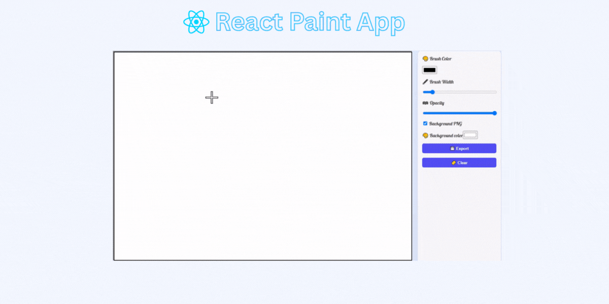

# Paint App



Live demo: https://paint-app-by-monir.netlify.app/

A lightweight browser-based painting application for drawing with mouse or touch. Save your artwork or clear the canvas and start fresh.

## Features
- Draw with mouse or touch
- Color picker
- Adjustable brush size
- Eraser
- Clear canvas
- Save canvas as an image

## Tech
- HTML, CSS, JavaScript
- Works in modern desktop and mobile browsers

## Run locally (Windows)
1. Clone the repo:
   ```
   git clone <repo-url>
   ```
2. Open the project folder and launch index.html in your browser, or run a simple server:
   ```
   cd paint-app
   npx http-server . -p 8080
   ```
   Then open http://localhost:8080

## Usage
- Use the toolbar to change color, size, or switch to eraser.
- Click/touch and drag on the canvas to draw.
- Use "Save" to download the current canvas as an image.

## Contributing
Open an issue or submit a pull request for improvements or bug fixes.

## License
MIT